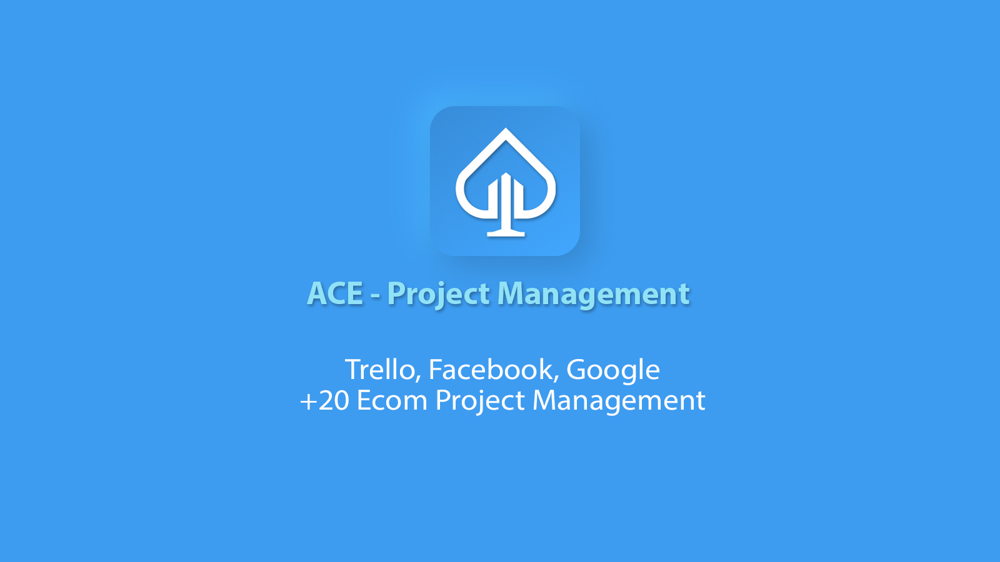

# ACE - Ecom Project Management 

Built with Laravel 7, JWT Auth, Vue 2, Vue Router 3, Vuex 3, Axios, Vuetify 2

## Installation:
* Clone the repo
* Copy `.env.example` to `.env`
* Configure `.env`
* Run `composer install`
* Run `php artisan key:generate`
* Run `php artisan jwt:secret`
* Run `php artisan migrate`
* Run `npm install`
* Make sure `storage/framework/cache`, `storage/framework/sessions`, `storage/framework/views` directories exist. Run `mkdir -p storage/framework/{sessions,views,cache}`

## Usage
* Run `npm run watch` for live reloading using BrowserSync
* Run `npm run hot` for hot reloading
* Run `npm run prod` for production build

## Bonus
* Lightweight [Vuetify Toast Snackbar](https://github.com/eolant/vuetify-toast-snackbar)
* Checkout this [Confirm Dialog Component](https://gist.github.com/eolant/ba0f8a5c9135d1a146e1db575276177d) that you can add and extend in your application
